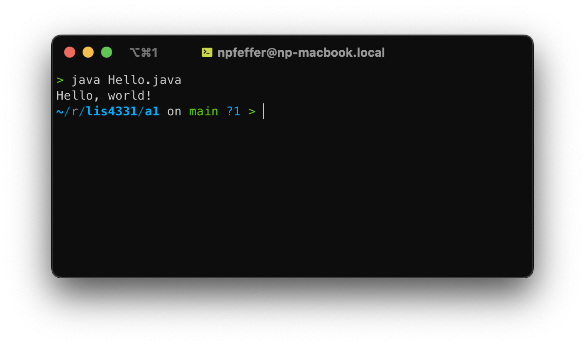

> **NOTE:** This README.md file should be placed at the **root of each of your repos directories.**

# LIS4331

## Nicholas Pfeffer

### A1 Requirements:

#### README.md file should include the following items:

- Screenshot of running JDK java Hello
- Screenshot of running Android Studio My First App
- Screenshot of running Android Studio Contacts App
- git commands and their descriptions

#### Git commands w/short descriptions:

1. git init - Initializes a new git repo in the working directory with an accompanying .git subdirectory

2. git status - Prints the status of any currently pending changes within the repo

3. git add - Followed by a specifier to determine which files to include in the next commit

4. git commit - Catalogs file changes with an accompanying commit message to describe any updates

5. git push - Pushes any local repo commits to a remote repo

6. git pull - Pulls changes made in a remote repo into a local repo (git fetch>git merge)

7. git branch - With arguments, can either list, create, or delete branches of a git repo

#### Assignment Screenshots:

| Screenshot of JDK running | Screenshot of My First App running |
| :-----------------------: | :--------------------------------: |
|  |  |

_Screenshot of Contacts App running_:

|                        Page 1                         |                        Page 2                         |
| :---------------------------------------------------: | :---------------------------------------------------: |
|  |  |
