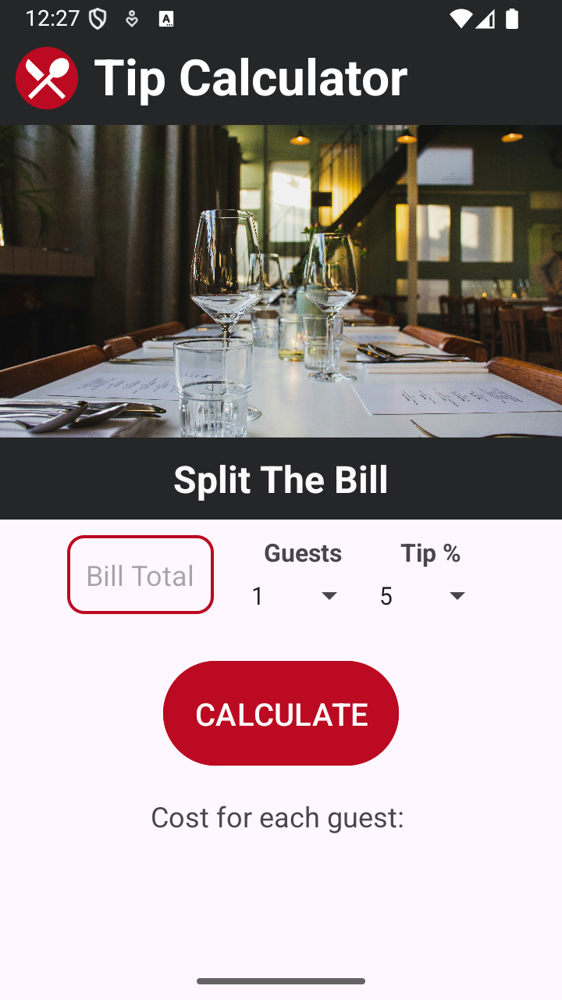
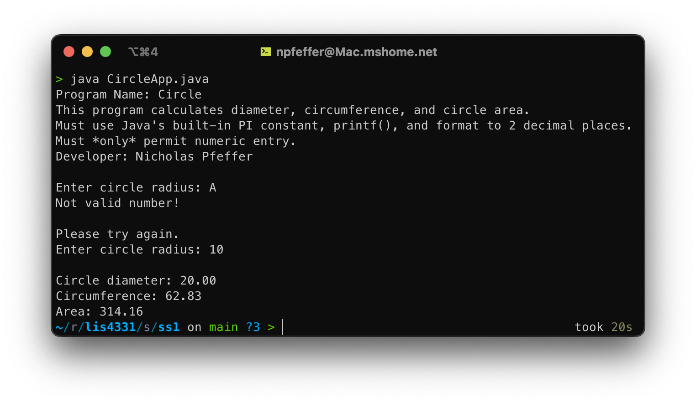
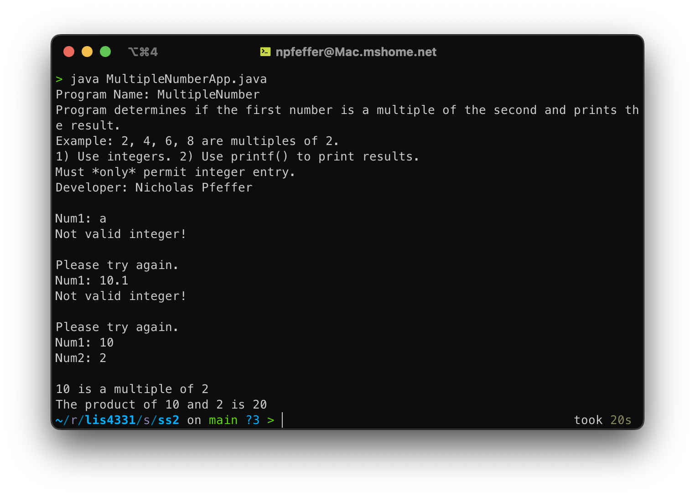
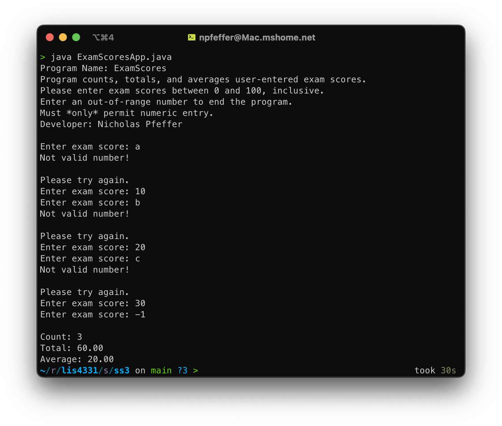

# LIS4331

## Nicholas Pfeffer

### A2 Requirements:

- Create Tip Calculator app
- Demo app using user-inputted data
- Complete skillsets that demonstrate Java comprehension

#### README.md file should include the following items:

- Screenshot of tip calculator without data
- Screenshot of tip calculator with data
- Screenshot of app in landscape orientation
- Screenshot of skillsets 1-3

### Assignment Screenshots:

_Screenshots of Tip Calculator App running_:

| App - Blank | App - Data |
| :-----------------------: | :--------------------------------: |
|  |  |

### Skillsets

| Screenshot 1 | Screenshot 2 | Screenshot 3 |
| :----------: | :----------: | :----------: |
|  |  |  |