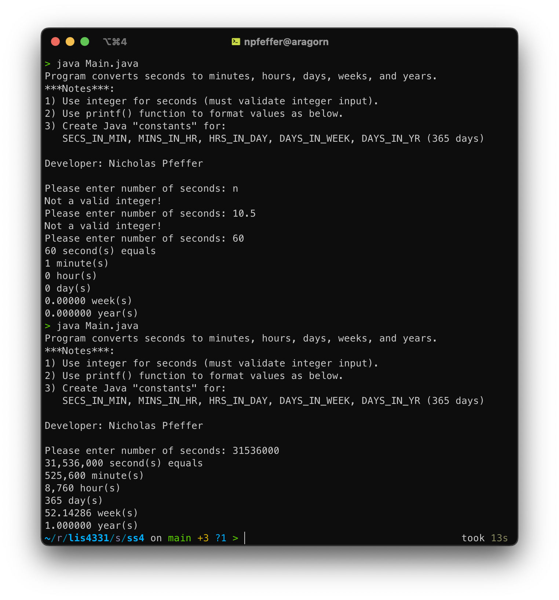

# LIS4331

## Nicholas Pfeffer

### A3 Requirements:

- Develop a currency converter app
- Implement a splash screen
- Include toast notifications for user interactions
- Ensure proper UI for user input and converted currency display
- Demonstrate skillsets 4, 5, and 6

#### README.md file should include the following items:

1. Course title, your name, assignment requirements (as per A1)
2. Screenshot of running application’s splash screen
3. Screenshot of running application’s unpopulated user interface
4. Screenshot of running application’s toast notification
5. Screenshot of running application’s converted currency user interface
6. GIF demonstration of the app in action

### GIF Demonstration:

# Skillsets

## Table of Contents

- [Java Time Conversion](#java-time-conversion)
- [Even/Odd Validator (GUI)](#evenodd-validator-gui)
- [Paint Cost Calculator (GUI)](#paint-cost-calculator-gui)

---

## Java Time Conversion

<!-- Basic Java Swing GUI application skills -->

| **Category**         | **Image Preview**                            | **Skill Set Demonstrated**                                       |
| -------------------- | -------------------------------------------- | ---------------------------------------------------------------- |
| Java Time Conversion |  | Creating formatted time conversion application using Java Swing. |

---

## Even/Odd Validator (GUI)

<!-- Java GUI-based Even/Odd Validator with data validation -->

| **Category**             | **Image Preview**                                                                                                                                                                        | **Skill Set Demonstrated**                                                                                                                               |
| ------------------------ | ---------------------------------------------------------------------------------------------------------------------------------------------------------------------------------------- | -------------------------------------------------------------------------------------------------------------------------------------------------------- |
| Even/Odd Validator (GUI) |              | - Implementing Java GUI input dialogs   - Validating integer input   - Determining even/odd values   - Handling incorrect user input gracefully |

---

## Paint Cost Calculator (GUI)

<!-- Java GUI-based paint cost calculator with formatted output -->

| **Category**                | **Image Preview**                                                                                                                                                                        | **Skill Set Demonstrated**                                                                                                                                                               |
| --------------------------- | ---------------------------------------------------------------------------------------------------------------------------------------------------------------------------------------- | ---------------------------------------------------------------------------------------------------------------------------------------------------------------------------------------- |
| Paint Cost Calculator (GUI) |              | - Implementing Java GUI for calculations   - Handling floating-point input validation   - Performing real-world cost calculations   - Formatting currency and numerical outputs |
