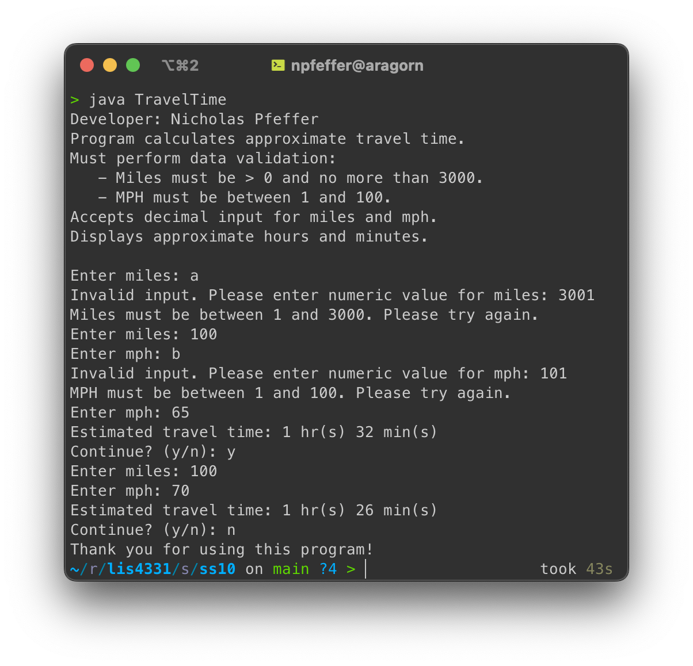
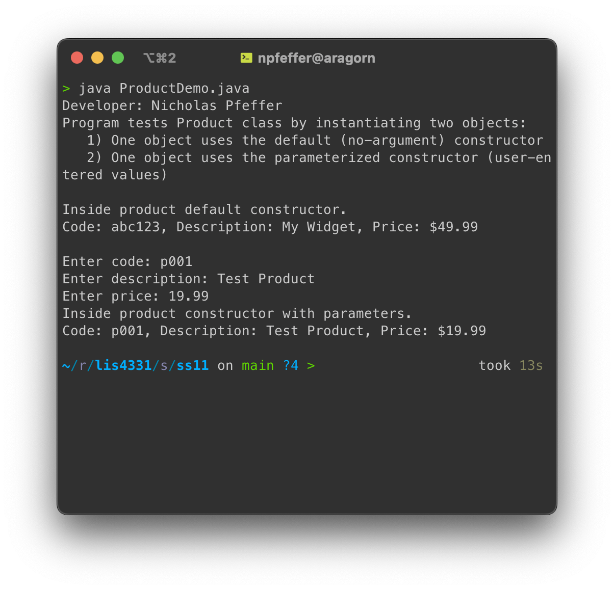
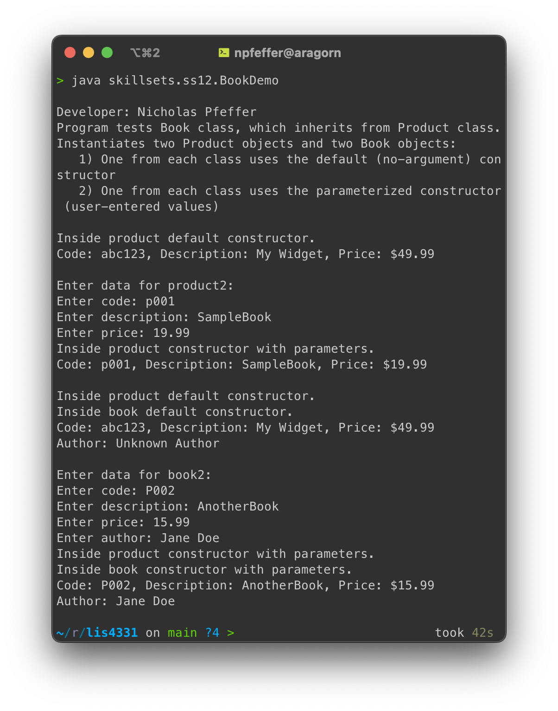

# LIS4331 - Assignment 4

## Nicholas Pfeffer

### Assignment 4 Requirements:

- Include a splash screen with an image, app title, and intro text.
- Display inputs for mortgage interest calculation.
- Ensure images and buttons are vertically and horizontally aligned.
- Implement background color(s) or a theme.
- Create and display a launcher icon image.
- Ensure the app is **scrollable** both **horizontally and vertically**.

### Part 2: README.md Deliverables

The README.md file must include the following:

1. Course title, your name, and assignment requirements.
2. Screenshot of the running application’s **splash screen**.
3. Screenshot of the running application’s **calculation screen** (with images and buttons).

### **Screenshots**

#### **Splash Screen**

#### **Main Screen**

#### **Failed Validation**

#### **Valid Entry and Calculation**

### **Skillsets**

#### **Skillset 10**

#### **Skillset 11**

#### **Skillset 12**
