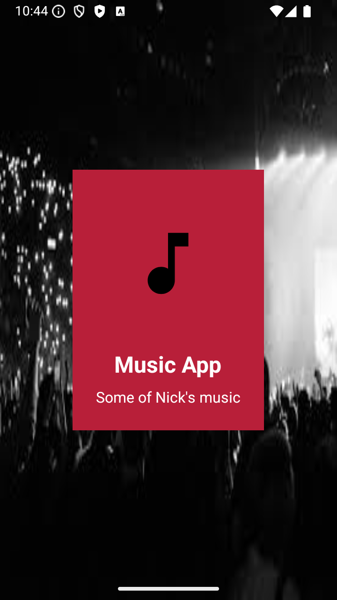
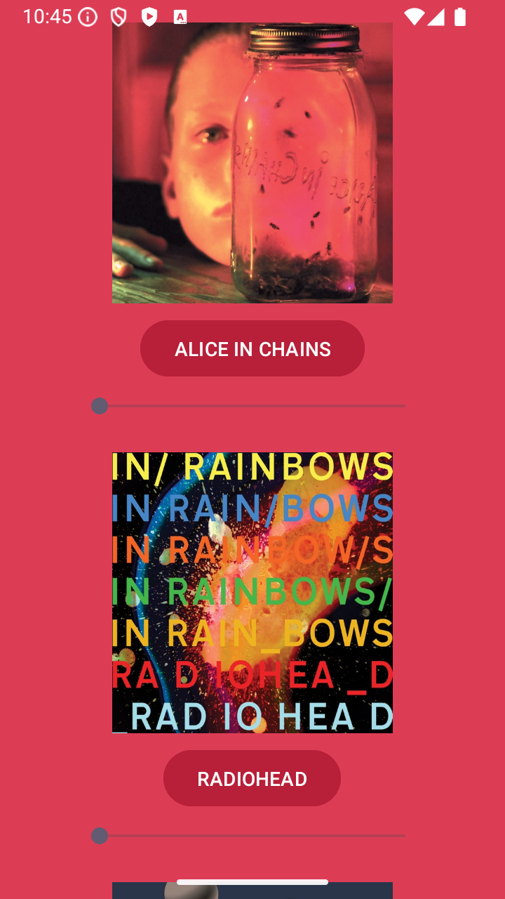
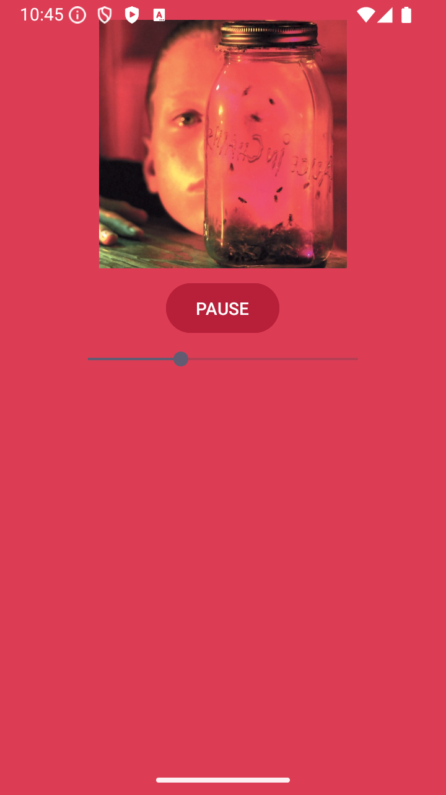
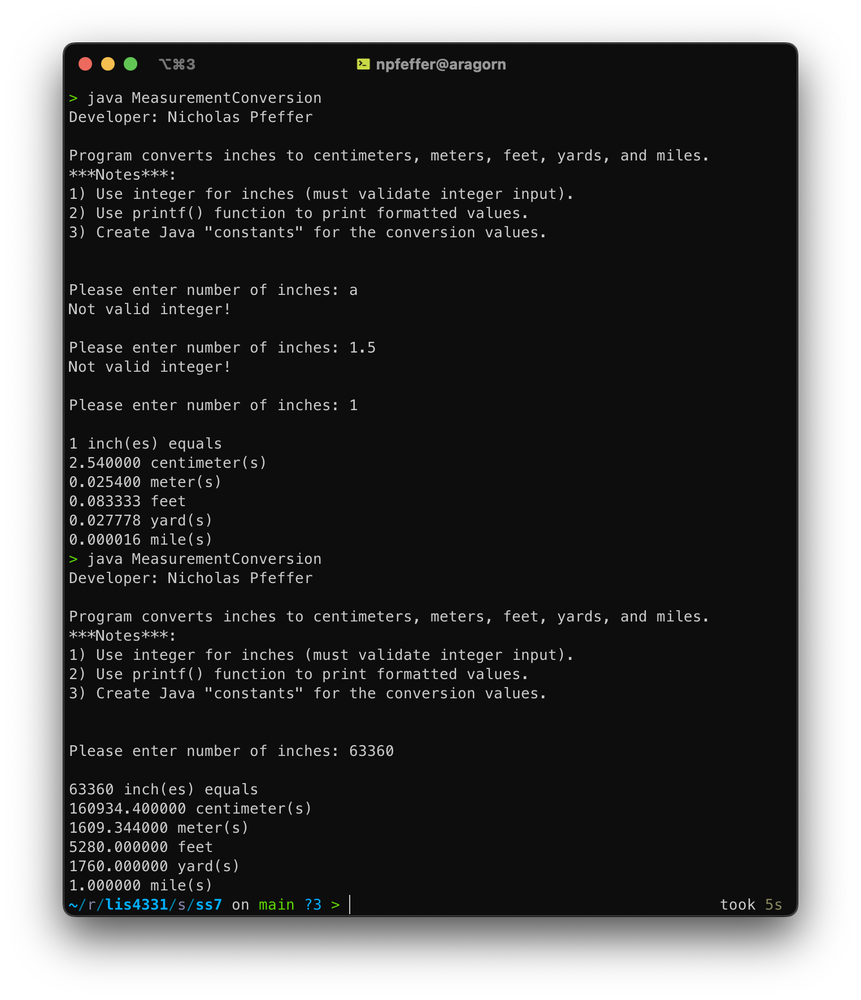
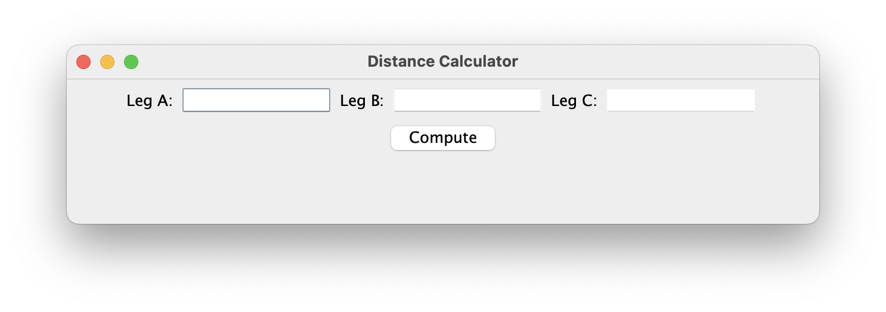
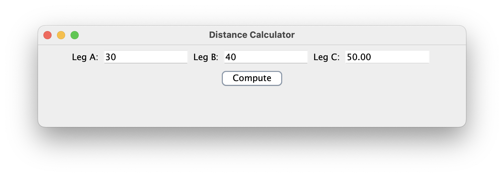
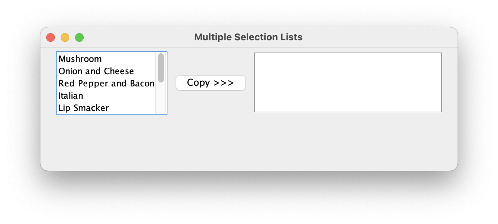
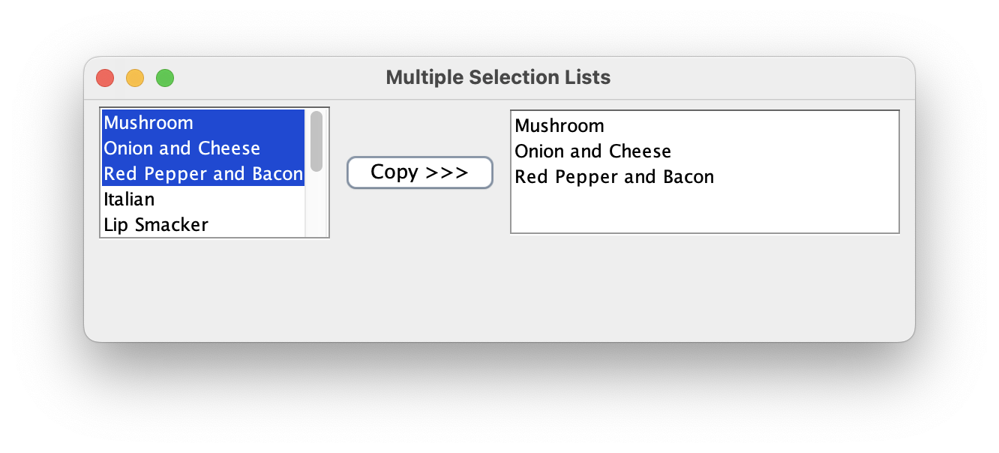
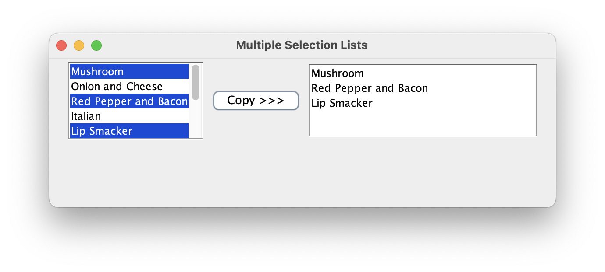

# LIS4331 - Project 1

## Nicholas Pfeffer

### Project 1 Requirements:

- Include a splash screen with an image, app title, and intro text.
- Display artists' images and media.
- Ensure images and buttons are vertically and horizontally aligned.
- Implement background color(s) or a theme.
- Create and display a launcher icon image.
- Ensure the app is **scrollable** both **horizontally and vertically** (10 pts).

### Part 2: README.md Deliverables

The README.md file must include the following:

1. Course title, your name, and assignment requirements.
2. Screenshot of the running application’s **splash screen**.
3. Screenshot of the running application’s **follow-up screen** (with images and buttons).
4. Screenshots of the running application’s **play and pause user interfaces** (with images and buttons).

### **Screenshots**

#### **Splash Screen**

#### **Opening Screen**

#### **Playing Screen**

### **Skillsets**

#### **Skillset 7**

#### **Skillset 8**

#### **Skillset 9**

